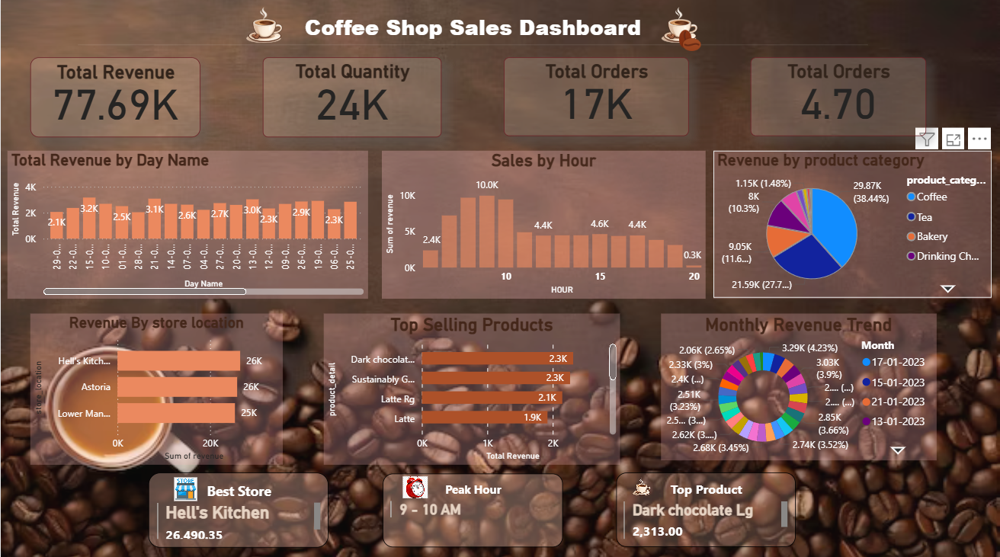

# ☕ Coffee Shop Sales Dashboard.
🚀 End-to-End Data Analysis Project using SQL + Power BI.

💡 Business Problem

The goal was to analyze retail coffee shop sales to identify trends, peak hours, and top-performing products to improve business decisions.

## 🚀 Key Insights

* Peak sales occur during morning hours (9–10 AM)
* Coffee category contributes highest revenue
* Hell’s Kitchen is the top-performing store
* Latte and similar beverages are top-selling products

## 🛠️ Tools Used
* SQL (Data Cleaning & Transformation), 
Data was cleaned and transformed using SQL before visualization in Power BI.
* Power BI (Data Visualization)
* Excel/CSV (Dataset)

## 📈 Dashboard Features

* KPI Cards (Revenue, Orders, Quantity, AOV)
* Sales by Day & Hour
* Product & Category Analysis
* Store Performance
* Interactive Filters

## 🖼️ Dashboard Preview

## 📂 Files

* coffee_sales_dashboard.pbix
* Coffee_Shop_Sales.xlsx
  

## 🎯 Conclusion

The dashboard helps identify trends and supports data-driven decisions for improving sales performance.
